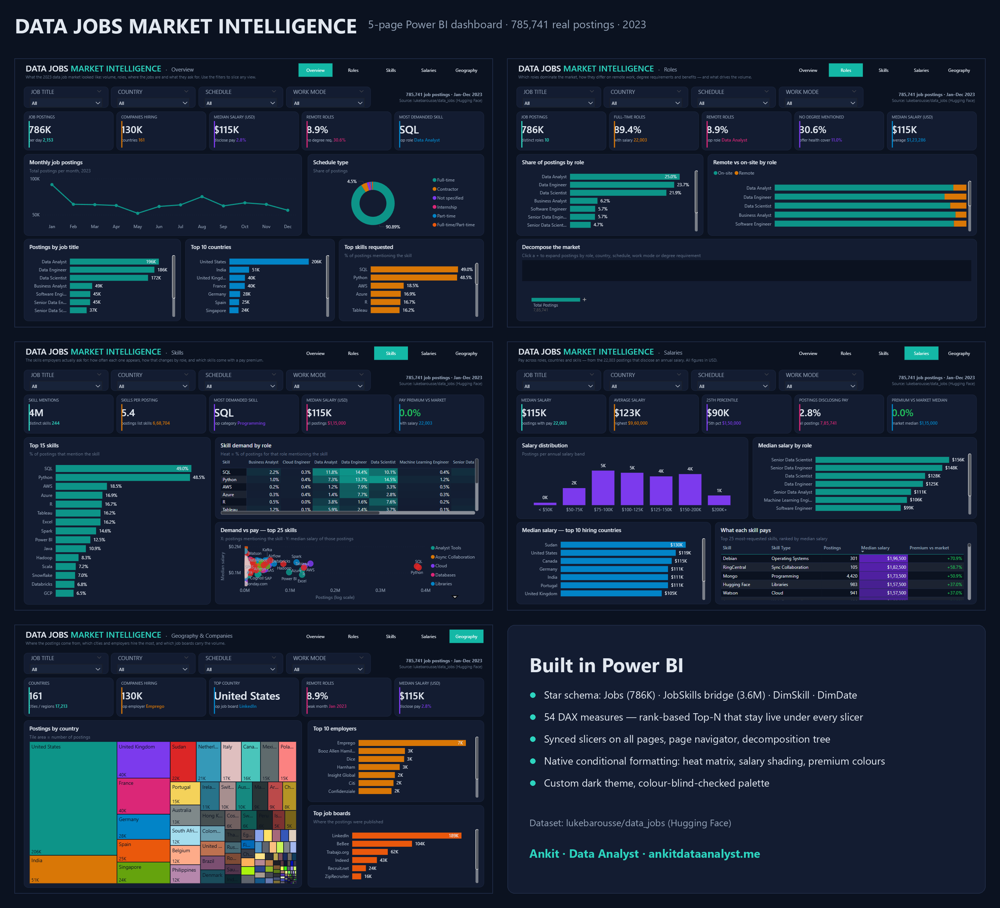
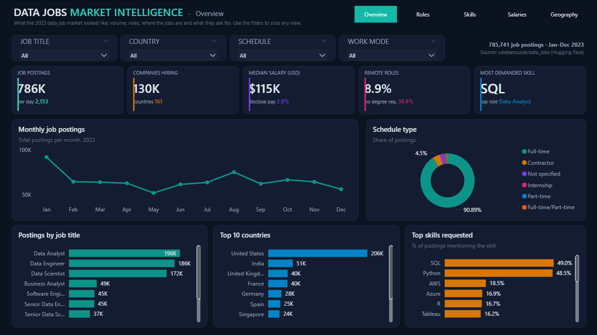
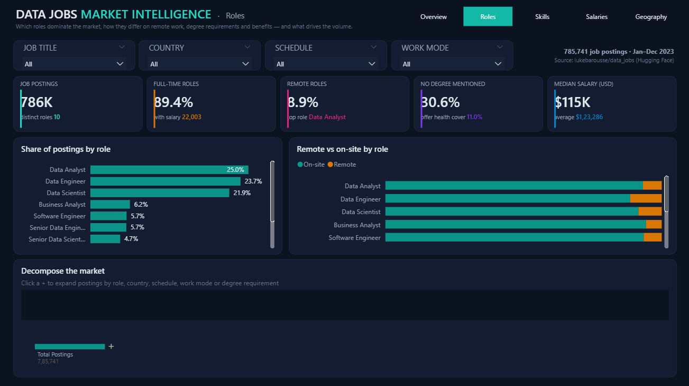
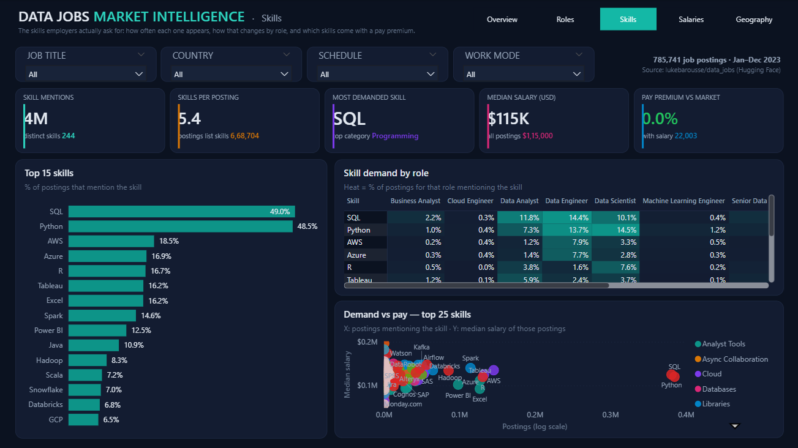
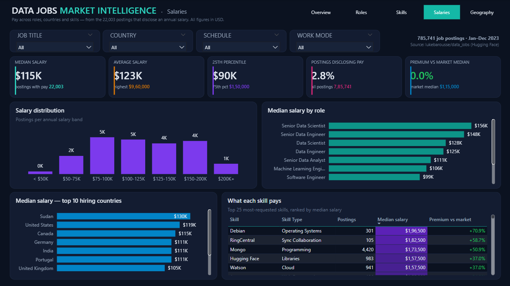
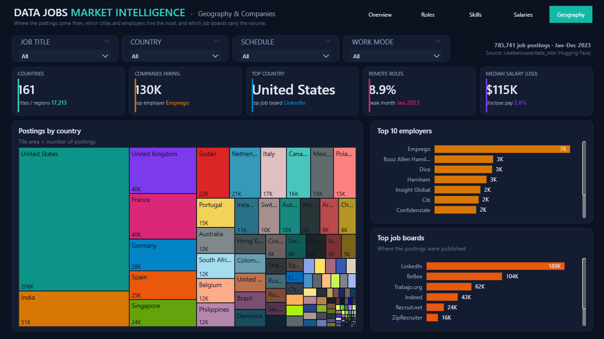

# Data Jobs Market Intelligence — Power BI

A five-page interactive Power BI report on **785,741 real data-job postings from 2023**: how many
jobs there are, which roles, where they are, which skills they ask for and what those skills pay.



**Built with:** Power BI Desktop · DAX · Power Query (M) · star-schema modelling · PBIP (TMDL + PBIR) ·
Python (pandas) for data prep · Node.js to generate the report from code

## Questions it answers

| # | Page | What it answers |
|---|------|-----------------|
| 1 | Overview | How many postings, the monthly trend, schedule mix, top roles, countries and skills |
| 2 | Roles | Share by role, remote vs on-site, and a decomposition tree (role → country → schedule → work mode → degree) |
| 3 | Skills | Top 15 skills, a skill × role heat matrix, and demand vs pay for every skill |
| 4 | Salaries | Salary distribution, median by role and country, and what each skill pays versus the market |
| 5 | Geography | Country treemap, top employers and top job boards |

Every page shares four synced slicers (Job Title, Country, Schedule, Work mode) and a page navigator.
All visuals cross-filter each other.

## Screenshots

| Overview | Roles |
|---|---|
|  |  |
| **Skills** | **Salaries** |
|  |  |
| **Geography** | |
|  | |

## Data model

Star schema with four tables and a measures table holding **54 DAX measures** in folders.

```
DimDate (2023) ──< Jobs (785,741 rows, one per posting) >──< JobSkills (3.59 M rows) >── DimSkill (244 skills)
```

- **Jobs:** one row per posting, with title, country, company, board, schedule, remote, degree and salary fields.
- **JobSkills:** the posting-to-skill bridge, filtering both ways so a skill slicer filters jobs.
- **DimSkill:** 244 skills, each typed (Programming, Cloud, Analyst Tools, Libraries and so on), deduplicated case-insensitively.
- **DimDate:** the 2023 calendar, marked as the date table.

## DAX techniques worth a look

- **Top-N that stays live:** ranking measures use `IF(RANKX(ALLSELECTED(...)) <= N, ...)`, so every top-N visual
  stays correct under any slicer combination.
- **Salary premium:** each skill's median salary is compared with the market median, and a colour measure turns
  the premium green or red.
- **Heat matrix and shading:** native conditional formatting driven by measures.

## Open it

1. Download the raw dataset (231 MB) from Hugging Face into `raw/data_jobs.csv`:
   <https://huggingface.co/datasets/lukebarousse/data_jobs>
2. Build the star-schema CSVs with `python tools/prep.py`, then `python tools/dedupe_skills.py`.
   Both scripts set their input and output folders at the top; change them to your paths.
3. Open `DataJobsMarket.pbip` in Power BI Desktop (version 2.150 or newer).
4. Go to Transform data → Manage parameters → `DataFolder`, point it at your `data\` folder, and click Refresh.

The two big CSVs (`Jobs.csv` at 137 MB and `JobSkills.csv`) are not in this repository because GitHub caps files
at 100 MB. The two small dimension tables are included.

## Built from code

`tools/build_pbip.mjs` writes the entire Power BI project: the TMDL semantic model and the PBIR report
(5 pages, 78 visuals, custom dark theme). The design lives in code, so every change shows up in a diff.
Re-running it overwrites the `.Report` and `.SemanticModel` folders; refresh once after reopening.

```
DataJobsMarket.pbip             open this in Power BI Desktop
DataJobsMarket.Report/          PBIR report definition
DataJobsMarket.SemanticModel/   TMDL model (tables, relationships, measures)
data/                           DimSkill.csv, DimDate.csv (Jobs and JobSkills are generated)
tools/prep.py                   raw CSV → star-schema CSVs
tools/dedupe_skills.py          case-insensitive skill-name dedupe
tools/build_pbip.mjs            generates the whole PBIP
screenshots/                    one PNG per page
```

## Source

Dataset: [lukebarousse/data_jobs](https://huggingface.co/datasets/lukebarousse/data_jobs) by Luke Barousse.
Postings were collected from Google Jobs across 2023. About 2.8% of postings disclose an annual salary, so the
salary page describes that subset.

## Author

**Ankit Gupta**, Data Analyst ·
[Portfolio](https://www.ankitdataanalyst.me/) ·
[LinkedIn](https://linkedin.com/in/ankit-gupta-data-analyst) ·
[All Power BI projects](https://github.com/Anki1004?tab=repositories&q=powerbi)
